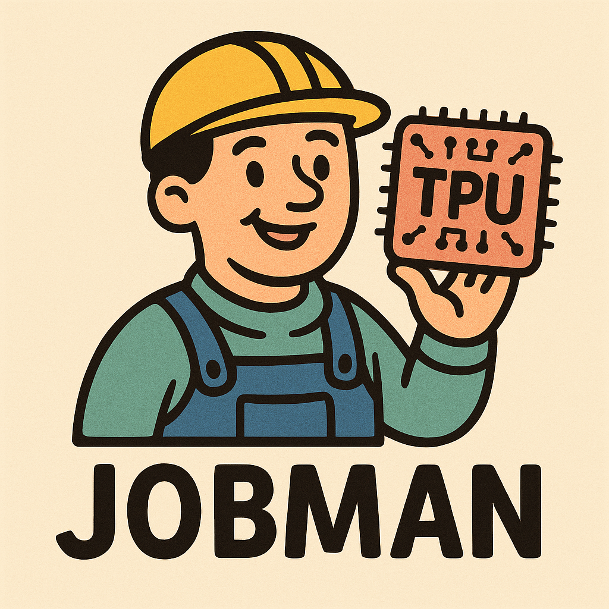

<h1 align="center">Jobman-v2</h1>

<p align="center">
  
</p>

Jobman-v2 is a modular and extensible job management system for TPU VMs. 

## Installation
```bash
python -m pip install --upgrade pip
pip install -e .
```

## Get Started 
Before you start using Jobman, be sure to go through [GET_STARTED.md](GET_STARTED.md). This is vital for you to proceed to run your own jobs.

## Overall Structure
Coming Soon!

## Other Resources

### Simoler TPU request tool
The design concept of Jobman is somewhat complex, but it aims to provide the easiest user interface s.t. user unfamiliar with TPU can quickly get started.  
For a simpler setup tool, you may refer to `other_resources/ultra_create_tpu.sh` by Peter Tong.

### Slack Chatbot
Boyang Zheng has also developed a brilliant Slack Chatbot that 1) automatically deletes dead tpu vms 2) profiles daily usage and sends to their Slack Channel. You may refer to it at `other_resources/slack_chatbot`.

## Dashboard
Coming soon

## FAQ
Coming soon

## Contributions & Feedback
If you have any issues with this project or want to contribute to it, please first open an issue in the `Issues` section. This will be of great help to the maintenance of this project!  
Also, if you would like to contribute to this project, please refer to [CONTRIBUTING.md](CONTRIBUTING.md).

